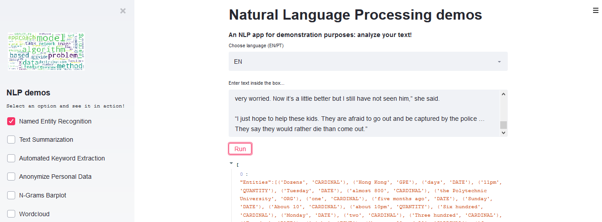
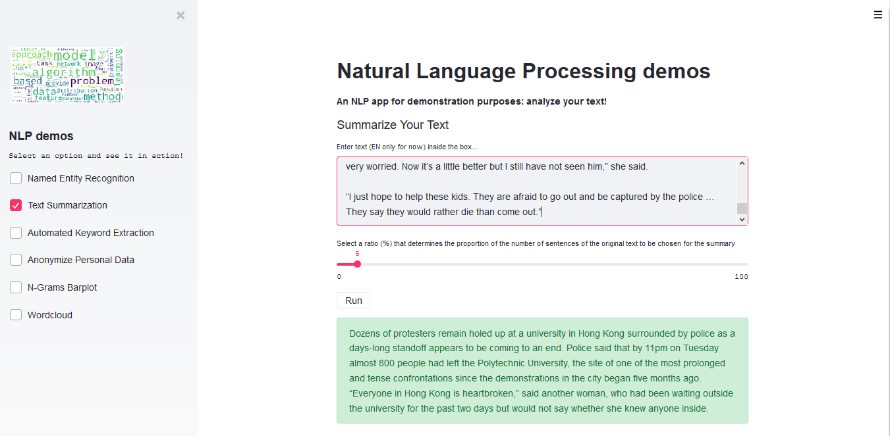
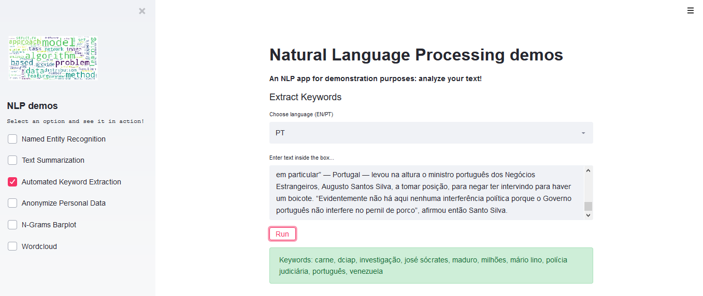
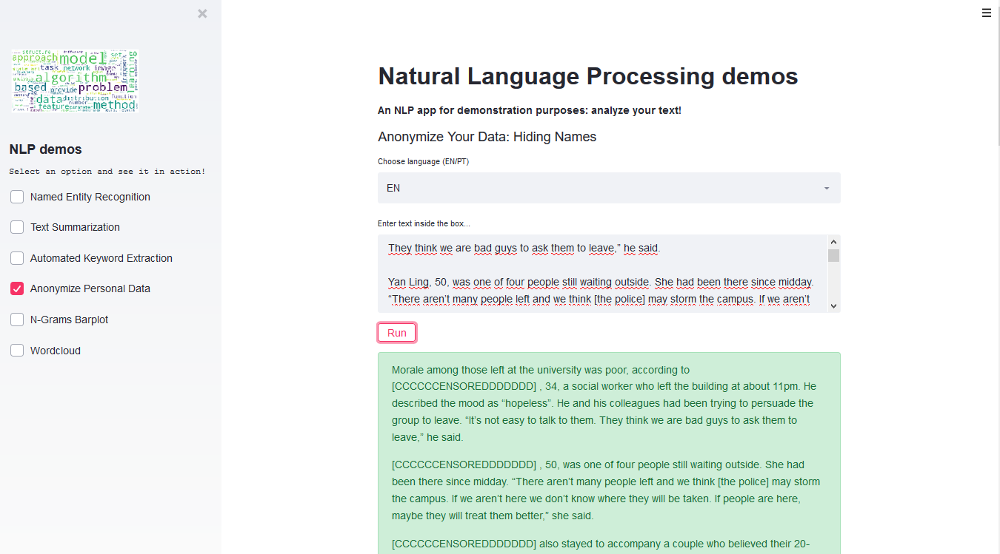
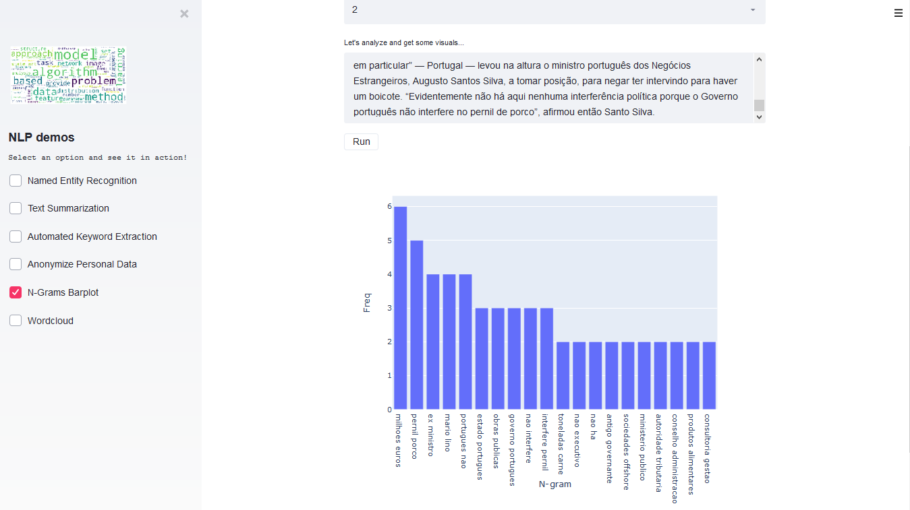
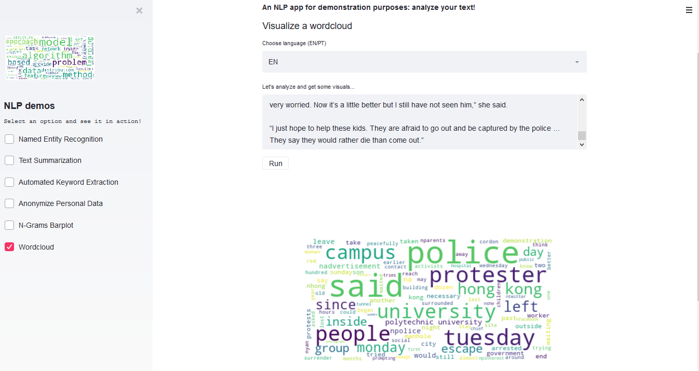

# Natural Language Processing app with demos
A NLP app built with streamlit for demonstration purposes.

You can check the demo directly here: https://nlp-demos-app.herokuapp.com/

Use your own text (PT and/or EN) directly in the app to see the results.
It includes the following demos:

+ Named Entity Recognition
+ Text Summarization
+ Automated Keyword Extraction
+ Anonymize Personal Data
+ N-Grams Barplot
+ Wordcloud

NOTE: this will be a constant on-going project, meaning that I will be adding other NLP applications.

#### Named Entity Recognition
Using spaCy's entity recognition, it returns entities: person, organizations, geopolitical entities, locations, quantities, etc.




#### Text Summarization
Uses gensim's summarize function, giving the user the possibility of chosing a proportion (ratio) of the number of sentences from the total to be returned as the summary.




#### Automated Keyword Extraction
Here, a keyword extractor that uses the YAKE! package.



#### Anonymize Personal Data
There are several different approaches regarding data anonymization (from simple regex techniques to anonymizing data by using differential privacy, as in the case of machine learning models, etc.); it all depends on the business needs and type of access.
Here, the approach is a simple and straightforward replacement of people's names by another string when the text is returned (firstly, the entity "PERSON" is extracted through spaCy's entity recognizer; the user may want to add in the code other entities, like Localizations).



#### N-Grams Barplot
The last two demos are the most simple and used ones over the years.
The output here is a barplot with the most frequent words (using the old well known concept of bag of words), giving the user the possibility to choose between 1, 2 or 3 N-Grams.



#### Wordcloud
Finally, the visualization of the old pal wordcloud. Therefore, nothing fancy going on here.




## Installing


#### With Docker

Build the container:

```
$ docker build -f Dockerfile -t app:latest .
```

And run it:
```
$ docker run -p 80:8080 -e PORT=8080 app:latest
```
Now, you just need to open it at http://localhost/.

#### Without Docker

At the command prompt:

```
$ pip install -r requirements.txt
```

To install the YAKE! package (for Automated Keyword Extraction):

```
$ pip install git+https://github.com/LIAAD/yake
```

Other required installations (spaCy models for Portuguese and English languages):

```
$ python -m spacy download pt_core_news_sm
```

```
$ python -m spacy download en_core_web_sm
```


#### Getting Started
```
$ streamlit run app.py
```

Enjoy!

